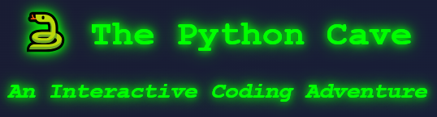

# 🐍 The Python Cave

**An Interactive Python Quiz Game with Retro Terminal Aesthetics**

Test your Python knowledge by answering riddles from a mystical serpent. Get them all right and escape the cave as a **Python Master**! 🏆

[](https://python-cave-quiz.streamlit.app/)



## 🎮 Play Now

👉 **[Play The Python Cave][https://your-app-url.streamlit.app](https://python-cave-quiz.streamlit.app/)**

## ✨ Features

- **5 Python Questions** ranging from language history to control flow
- **Retro Terminal Design** with green glow effects and dark background
- **Immersive Audio** including background music, success/failure sounds, and victory theme
- **Interactive Gameplay** with immediate feedback and fun narrative
- **Responsive Design** works on mobile, tablet, and desktop

## 🎯 How to Play

0. Activate sound (Top right corner, **HIGHLY RECOMMENDED**) 
1. Click **"Enter the Cave"** to start
2. Answer each Python question carefully
3. Get instant feedback with sound effects
4. Make it through all 5 questions to become a **Python Master**
5. One wrong answer and you're back to the start!

## 🛠️ Tech Stack

- **Framework**: [Streamlit](https://streamlit.io/)
- **Language**: Python 3.11+
- **Styling**: Custom CSS with terminal aesthetics
- **Audio**: Base64-encoded MP3 files
- **Deployment**: Streamlit Community Cloud

## 📁 Project Structure

```
python-cave-quiz/
├── .streamlit/
│   └── config.toml       # Streamlit configuration
├── .gitignore
├── app.py                 # Main application
├── assets/
│   ├── background_music.mp3
│   ├── success.mp3
│   ├── gameover.mp3
│   └── final_victory.mp3
├── CREDITS.md
├── LICENSE
├── PRIVACY.md
├── README.md
├── requirements.txt       # Python dependencies
└── screenshot.png
```

## 🚀 Run Locally

### Prerequisites

- Python 3.8 or higher
- pip

### Installation

1. **Clone the repository**
   ```bash
   git clone https://github.com/your-username/python-cave-quiz.git
   cd python-cave-quiz
   ```

2. **Install dependencies**
   ```bash
   pip install -r requirements.txt
   ```

3. **Run the app**
   ```bash
   streamlit run app.py
   ```

4. **Open your browser** to `http://localhost:8501`

## 🎵 Audio Credits

See [CREDITS.md](CREDITS.md) for audio sources and licenses.

## 📊 Analytics & Privacy

This app uses Google Analytics with privacy-first settings:
- IP addresses are anonymized
- No cross-device tracking
- No ad personalization
- See our full [Privacy Policy](PRIVACY.md)

## 🤝 Contributing

Contributions are welcome! Feel free to:
- Report bugs
- Suggest new questions
- Improve the design
- Add new features

## 📄 License

This project is licensed under the MIT License - see the [LICENSE](LICENSE) file for details.

## 🙏 Acknowledgments

- Inspired by classic text adventure games
- Built with ❤️ using Streamlit
- Audio from Pixabay (royalty-free)

---

**Made with 🐍 Python & Streamlit**

*Play smart, code smarter!*
